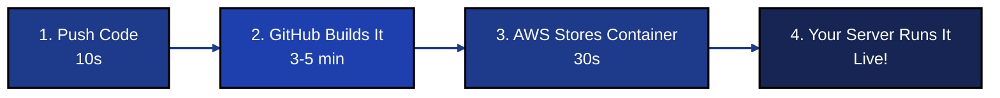
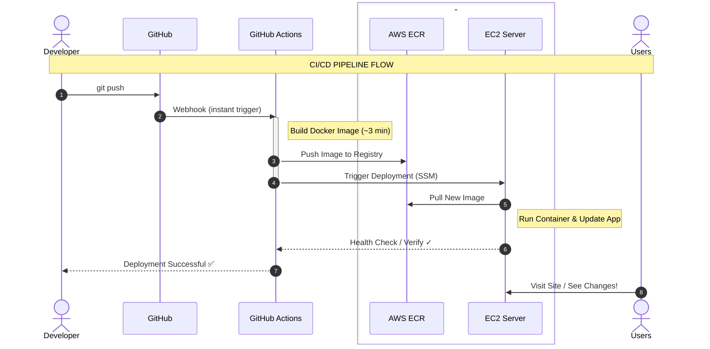
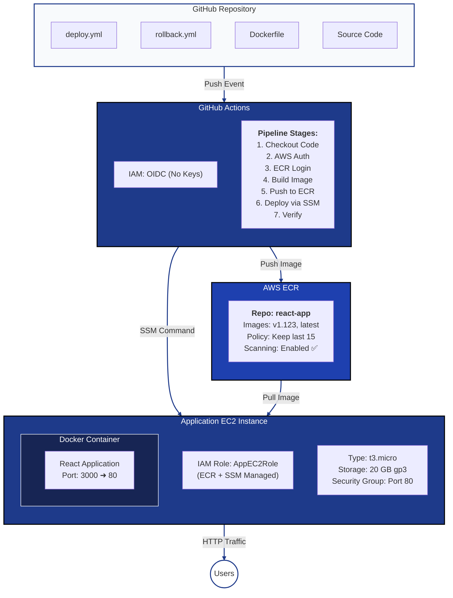
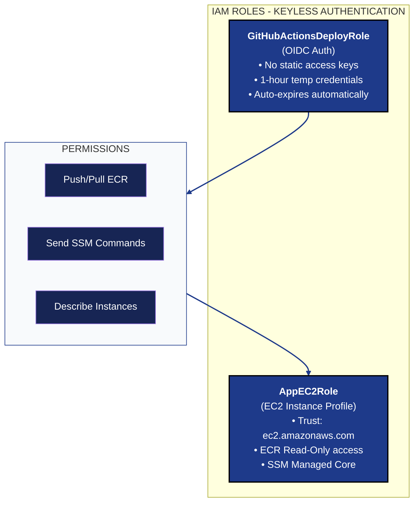

# Automated CI/CD Pipeline with GitHub Actions & AWS

An automated CI/CD pipeline that automatically builds Docker images, pushes them to AWS ECR, and deploys to EC2 instance using GitHub Actions all without hardcoded secrets or SSH keys.

### 🎯 What This Does

Every time you push code to GitHub:
* Automatically builds your app
* Packages it in a Docker container
* Stores it in AWS ECR
* Deploys to your EC2 Server
* Makes it live for users

### 📖 How It Works (Simple Explanation)


### ✨ Features
- FREE CI/CD - GitHub Actions
- Zero Secrets - Uses IAM roles.No access keys or SSH keys in code.
- 50%+ Faster Builds - Docker layer caching with BuildKit
- Automatic Versioning -  YYYYMMDD-HHMMSS-BUILD-COMMIT format
- Easy Rollbacks - One-click rollback to any previous version
- Secure Deployment - AWS Systems Manager (no SSH required)
- Private Registry - ECR with automatic image scanning
- Automated CI/CD - Push to main triggers automatic deployment
- Full Traceability - Track every deployment with version tags


## 🏗️ Architecture

### The Simple Version
                              HOW IT ALL WORKS

    YOU                GITHUB              AWS             USERS
     │                   │                  │                │
     │ git push          │                  │                │
     ├──────────────────>│                  │                │
     │                   │                  │                │
     │                   │ Build app        │                │
     │                   │ (3-5 min)        │                │
     │                   │                  │                │
     │                   │ Store it         │                │
     │                   ├─────────────────>│                │
     │                   │                  │                │
     │                   │ Deploy it        │                │
     │                   ├─────────────────>│                │
     │                   │                  │                │
     │                   │                  │ Visit site     │
     │                   │                  │<───────────────┤
     │                   │                  │                │
     │ ✅ Done!          │                  │ See changes! ✓ │
     │                   │                  │                │

### High Level Architecture



### Detailed Component Architecture



### Security Architecture


        
## 🚀 Quick Start
### Prerequisites
You need:
- AWS Account
- GitHub account
- Docker knowledge

### 1. Clone Repository
```
git clone https://SherryObuhuma/react-portfolio.git
```

### 2. Setup AWS Infrastructure
* IAM role with OIDC (GitHub Actions + Application)
* ECR repository
* EC2 instance (Application)
* Security groups

### 3. Configure GitHub Secrets
1. Go to your repo → Settings → Secrets and variables → Actions
2. Click New repository secret
3. Add these 5 secrets:

### 🛠️ Required GitHub Secrets

| Secret Name | What to Put | Where to Get It |
| :--- | :--- | :--- |
| **`AWS_REGION`** | `us-east-1` | Your preferred AWS region |
| **`AWS_ROLE_ARN`** | `arn:aws:iam::123...` | From AWS IAM Role (OIDC) |
| **`ECR_REGISTRY`** | `123.dkr.ecr...` | From AWS ECR Console |
| **`ECR_REPOSITORY`** | `react-app` | Your ECR repository name |
| **`EC2_INSTANCE_ID`** | `i-0ab...` | From AWS EC2 Console |

### 4. Workflow Files Already Included
The repository includes:
- [`.github/workflows/deploy.yml`](./.github/workflows/deploy.yml) - Main deployment
- [`.github/workflows/rollback.yml`](./.github/workflows/rollback.yml) - Rollback workflow

### 5. Deploy
```
# Make a change and push
echo "# Test deployment" >> README.md
git add .
git commit -m "test: trigger deployment"
git push origin main

# GitHub Actions will detect and deploy automatically!
# Check progress at: github.com/yourrepo/actions
```

## ⚙️ How It Works
### Workflow Stages Explained
- stage('Checkout')------------# Clone repo, get git commit SHA
- stage('AWS Auth OIDC')-------# Get temporary credentials (no keys!)
- stage('ECR Login')-----------# Authenticate to ECR (IAM role)
- stage('Pull Cache')----------# Download previous build layers
- stage('Build Image')---------# Build with BuildKit caching
- stage('Push to ECR')---------# Upload with 4 different tags
- stage('Deploy via SSM')------# Remote deployment (no SSH)
- stage('Verify')--------------# Confirm container is running

### Version Tagging Strategy
Each build creates a version like:
```
20240207-143022-456-a1b2c3d
│        │      │   │
│        │      │   └─ Git commit (7 chars)
│        │      └───── GitHub run number
│        └──────────── Timestamp (HHmmss)
└───────────────────── Date (YYYYMMDD)
```

Why this format?
+ Chronologically sortable
+ Unique for every build
+ Easy to trace back to code
+ Human readable

### Docker Layer Caching
How it saves 50% time:

1. First build: Download everything

   - FROM node:18-alpine          ← Downloaded (100 MB)
   - COPY package.json            ← New layer
   - RUN npm install              ← Downloaded deps (200 MB)
   - COPY . .                     ← New layer
   - RUN npm build                ← Build (2 min)

2. Second build (no code changes):

   - FROM node:18-alpine          ← CACHED ✓ (0 sec)
   - COPY package.json            ← CACHED ✓ (0 sec)
   - RUN npm install              ← CACHED ✓ (0 sec)
   - COPY . .                     ← CACHED ✓ (0 sec)
   - RUN npm build                ← CACHED ✓ (0 sec)

3. Second build (code changed):

   - FROM node:18-alpine          ← CACHED ✓ (0 sec)
   - COPY package.json            ← CACHED ✓ (0 sec)
   - RUN npm install              ← CACHED ✓ (0 sec)
   - COPY . .                     ← REBUILD (new code)
   - RUN npm build                ← REBUILD (1 min)

## 🔄 Rollback
### List Available Versions
   ```
   ./scripts/list-versions.sh

# Output:
# Currently deployed: 20240207-143022-456-a1b2c3d
# 
# Available Versions:
# 20240207-143022-456-a1b2c3d  (Current)
# 20240207-120000-455-xyz1234
# 20240206-180000-454-abc5678
```

### Rollback to Previous Version
GitHub Actions Workflow:

1. Go to Actions tab
2. Click [`.github/workflows/rollback.yml`](./.github/workflows/rollback.yml)
3. Click Run workflow
4. Enter version: 20240207-120000-455-xyz1234
5. Click Run workflow

## Cost Analysis
### Cost Optimization Options

* Option 1: Spot Instances (Save 70%)
   App: t3.micro Spot = $2/mo
   (Total: ~$3.50/mo)

* Option 2: Smaller Instances
   App: t3.nano = $4/mo
   (Total: ~$5/mo)

* Option 3: Stop when not in use
   Only run during work hours (8h/day, 5 days/week)
   (Total: ~$2/mo)

* GitHub Actions Free Tier
   - 2,000 minutes/month (public repos)
   - 500 MB storage
   - Unlimited for public repos
   - Typical build: 3-5 minutes

## 🙏 Full Blog

If you would like to read a detailed description of the project, here is the link to the article on my medium account [`https://medium.com/@SherryObuhuma/automated-ci-cd-pipeline-with-github-actions-aws-f1b33307f4a2`](https://medium.com/@SherryObuhuma/automated-ci-cd-pipeline-with-github-actions-aws-f1b33307f4a2)
